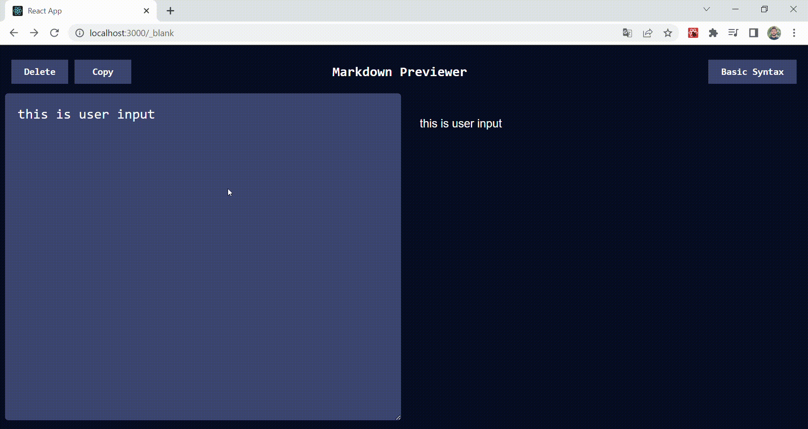

# Markdown Previewer (React)
React.js ; I developed with. With its simple interface for using markdown, you can practice and create your files. 
You can copy the text with the Copy button. You can use the delete button to clear the page. 
For simple markdown writing rules, you can reach the original tutorial page with the button on the top right of the page.


## Live Link of the Project
[https://markdown-previewer-with-react.netlify.app/](https://markdown-previewer-with-react.netlify.app/)

## Preview



## Requirements
```
git clone https://github.com/volkantepeli/markdown-previewer.git
```
```
npm install
```
```
npm start
```
## Used technologies


<br>
</br>

## Reach out to me

[linkedin]: https://www.linkedin.com/in/volkantepeli/

[][linkedin]